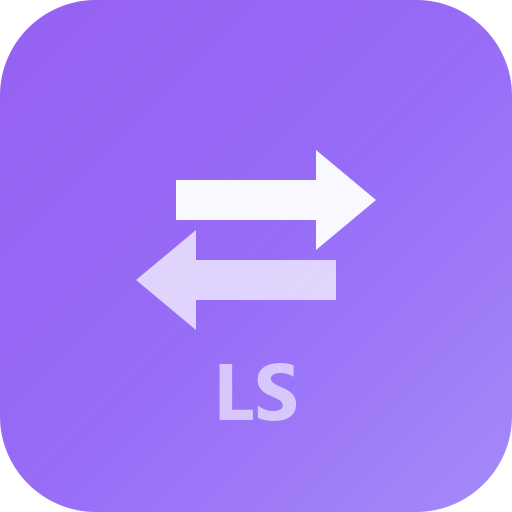

<div align="center">



# LangSwitch

**Instant keyboard layout switcher for Windows 11**

Fast, lightweight, and reliable alternative to the broken built-in Windows language switching.

[](https://github.com/Memorem/simple_lang_switcher/releases)
[](LICENSE)
[](https://www.microsoft.com/windows)

[English](#english) | [Русский](#русский)

</div>

---

## English

### Why?

Windows 11 language switching is **unreliable**. You press `Alt+Shift` 10-15 times and it doesn't switch. This is unacceptable for developers who constantly switch between EN and RU layouts.

**LangSwitch** fixes this by using low-level Windows API to **instantly** switch the input language — every single time, without fail.

### Features

- **Instant language switching** via global hotkey (works in any app, including elevated/admin windows)
- **System tray** with current language indicator
- **Configurable hotkeys** — Alt+Shift, Ctrl+Shift, Ctrl+Space, CapsLock, or any custom combo
- **Disable Windows built-in switcher** — one-click registry toggle to prevent conflicts
- **Auto-start** with Windows
- **Windows toast notifications** on language change
- **Settings persistence** — survives reboots
- **Dark Material 3 UI** — modern, clean, book-format settings window
- **Tiny footprint** — ~3.5 MB installer, minimal resource usage
- **Runs as admin** — ensures hotkeys work everywhere

### Tech Stack

| Layer | Technology |
|-------|-----------|
| Backend | Rust + Windows API (`WH_KEYBOARD_LL`, `WM_INPUTLANGCHANGEREQUEST`) |
| Frontend | SolidJS + Solid UI (Kobalte) + Tailwind CSS |
| Framework | Tauri v2 |
| Build | Vite + Bun |
| Installer | MSI (perMachine, admin privileges) |

### Installation

1. Download the latest `.msi` installer from [Releases](https://github.com/Memorem/simple_lang_switcher/releases)
2. Run the installer (requires admin privileges)
3. LangSwitch starts automatically and lives in the system tray

### Usage

1. **Switch language** — press your configured hotkey (default: `Alt+Shift`)
2. **Open settings** — click the tray icon or right-click → Show Window
3. **Disable Windows switcher** — go to Hotkeys tab → click "Disable Windows hotkeys"
4. **Change hotkey** — go to Hotkeys tab → click the hotkey box and press your combo, or select a preset

### Building from Source

**Prerequisites:** Rust 1.77+, Bun 1.0+, Node.js 22+

```bash
git clone https://github.com/Memorem/simple_lang_switcher.git
cd simple_lang_switcher
bun install
bun run tauri build
```

The installer will be in `src-tauri/target/release/bundle/msi/`

### Tested On

- **Windows 11 Pro** Build 26200.8037

> **Note:** This application is designed for and tested only on Windows 11. It may work on Windows 10 but is not guaranteed.

---

## Русский

### Зачем?

Переключение языка в Windows 11 — **ненадёжное**. Жмёшь `Alt+Shift` по 10-15 раз и оно не срабатывает. Для разработчиков, которые постоянно переключаются между EN и RU раскладками, это неприемлемо.

**LangSwitch** решает эту проблему, используя низкоуровневый Windows API для **мгновенного** переключения языка — каждый раз, без осечек.

### Возможности

- **Мгновенное переключение языка** через глобальный хоткей (работает в любом приложении, включая запущенные от администратора)
- **Иконка в системном трее** с индикатором текущего языка
- **Настраиваемые хоткеи** — Alt+Shift, Ctrl+Shift, Ctrl+Space, CapsLock, или любая кастомная комбинация
- **Отключение стандартного переключателя Windows** — одним кликом через реестр, без конфликтов
- **Автозапуск** вместе с Windows
- **Уведомления Windows** при смене языка
- **Сохранение настроек** — переживают перезагрузки
- **Тёмная тема Material 3** — современное окно настроек в книжном формате
- **Минимальный размер** — ~3.5 МБ установщик, минимальное потребление ресурсов
- **Запуск от администратора** — хоткеи работают везде

### Установка

1. Скачайте последний `.msi` установщик из [Releases](https://github.com/Memorem/simple_lang_switcher/releases)
2. Запустите установщик (требуются права администратора)
3. LangSwitch запустится автоматически и будет жить в системном трее

### Использование

1. **Переключить язык** — нажмите настроенный хоткей (по умолчанию: `Alt+Shift`)
2. **Открыть настройки** — кликните на иконку в трее или ПКМ → Show Window
3. **Отключить переключатель Windows** — вкладка Hotkeys → нажмите "Disable Windows hotkeys"
4. **Сменить хоткей** — вкладка Hotkeys → кликните на поле хоткея и нажмите комбинацию, или выберите пресет

### Сборка из исходников

**Требования:** Rust 1.77+, Bun 1.0+, Node.js 22+

```bash
git clone https://github.com/Memorem/simple_lang_switcher.git
cd simple_lang_switcher
bun install
bun run tauri build
```

Установщик будет в `src-tauri/target/release/bundle/msi/`

### Протестировано на

- **Windows 11 Pro** Build 26200.8037

> **Примечание:** Приложение разработано и протестировано только на Windows 11. Может работать на Windows 10, но не гарантируется.

---

<div align="center">

Made with Rust, SolidJS, and Tauri

</div>
